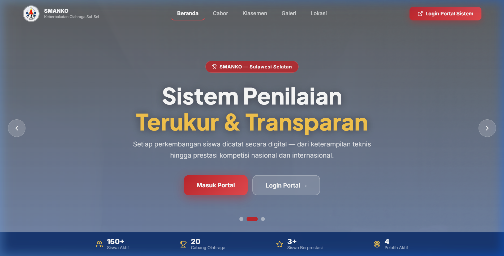
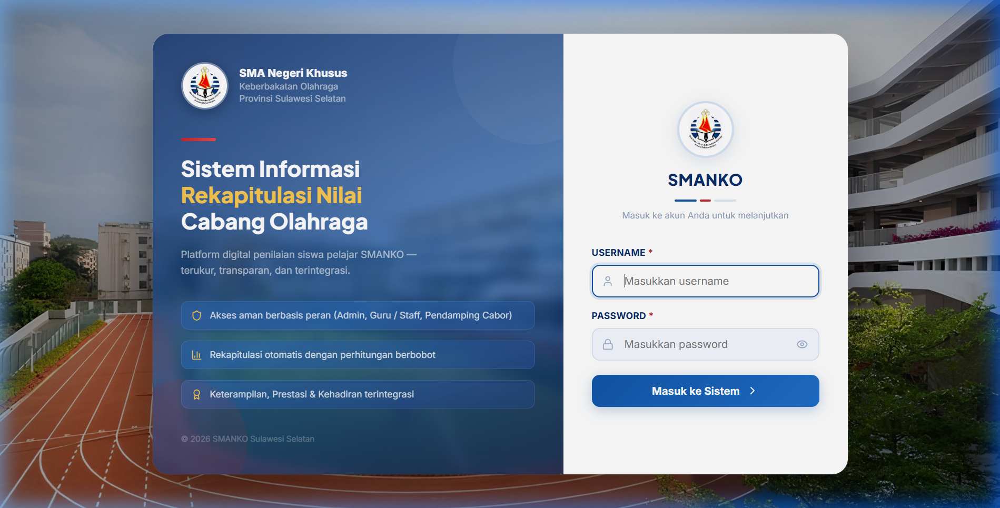
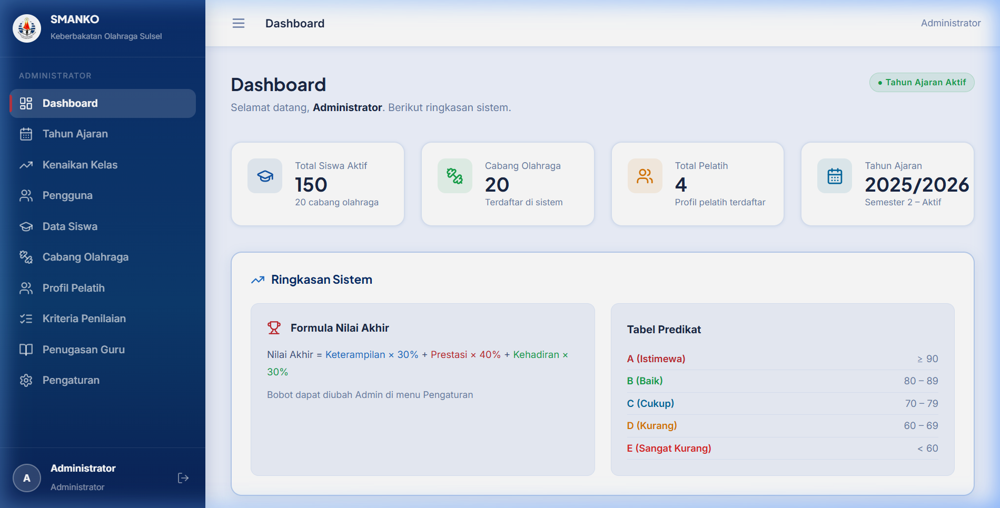
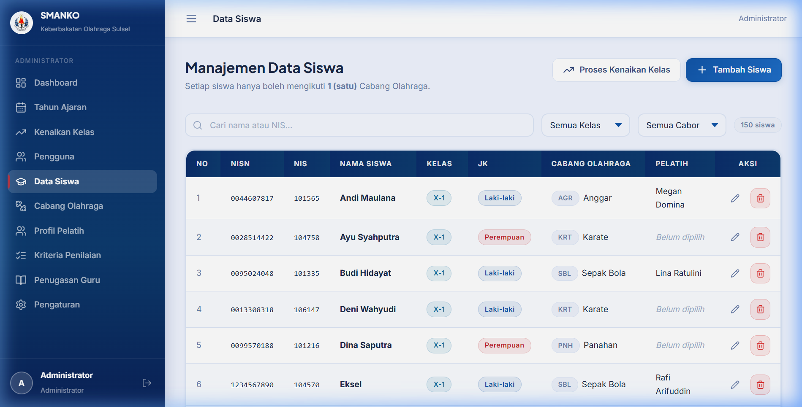

<div align="center">
  
  <h1>SMANKO – Sistem Informasi Rekapitulasi Nilai Cabang Olahraga</h1>
  <p>Platform digital penilaian siswa pelajar SMANKO Sulawesi Selatan — terukur, transparan, dan terintegrasi.</p>

  
  
  
  
  
</div>

---

## 📸 Preview

### 🏠 Landing Page


### 🔐 Halaman Login


### 📊 Dashboard Administrator


### 👨‍🎓 Manajemen Data Siswa


---

## ✨ Fitur Utama

| Fitur | Deskripsi |
|-------|-----------|
| 🏆 **Penilaian Multikomponen** | Nilai Akhir dihitung dari Keterampilan, Prestasi, dan Kehadiran dengan bobot yang dapat dikonfigurasi |
| 🎯 **Multi-Pelatih per Cabor** | Setiap siswa dapat ditautkan ke pelatih spesifik di cabang olahraga yang memiliki lebih dari satu pelatih |
| 📄 **Cetak PDF Raport** | Generate laporan penilaian per siswa dalam format A4 dengan tanda tangan pelatih yang dinamis |
| 📊 **Klasemen Publik** | Landing page menampilkan papan peringkat siswa berdasarkan nilai akhir |
| 🔒 **Role-Based Access** | Tiga level akses: Administrator, Guru Olahraga, dan Wakasek |
| 🏫 **Kenaikan Kelas Otomatis** | Proses kenaikan kelas massal dengan satu klik |
| 🖼️ **Galeri Prestasi** | Upload dan tampilkan foto piagam/medali prestasi siswa |

---

## 🛠️ Tech Stack

- **Frontend**: React 19 + TypeScript + Vite
- **Backend**: PHP 8 (Native REST API)
- **Database**: MySQL / MariaDB
- **Server Lokal**: XAMPP
- **Styling**: Vanilla CSS (Custom Design System)
- **Icons**: Lucide React

---

## 🚀 Cara Instalasi Lokal

### Prasyarat
- XAMPP (PHP 8 + MySQL)
- Node.js 18+

### Langkah-langkah

```bash
# 1. Clone repository
git clone https://github.com/Fachryi/smanko_web.git
cd smanko_web

# 2. Install dependencies frontend
npm install

# 3. Jalankan dev server
npm run dev
```

**Setup Database:**
1. Buka phpMyAdmin → Buat database baru bernama `smko_db`
2. Import file SQL: `api/database/schema.sql`
3. (Opsional) Import data dummy: jalankan `api/database/generate_dummy.php` via browser

**Konfigurasi:**
- Edit `api/config/database.php` sesuaikan host, username, dan password MySQL Anda

---

## 👤 Akun Default

| Role | Username | Password |
|------|----------|----------|
| Administrator | `admin` | `admin123` |
| Guru Olahraga | `guru1` | `guru123` |
| Wakasek | `wakasek` | `wakasek123` |

> ⚠️ **Ganti password setelah instalasi pertama!**

---

## 📁 Struktur Proyek

```
smanko_web/
├── api/                  # Backend PHP REST API
│   ├── config/           # Konfigurasi database
│   ├── master/           # Endpoint data master (siswa, guru, cabor, dll)
│   ├── penilaian/        # Endpoint input & rekap penilaian
│   ├── public/           # Endpoint publik (landing page)
│   ├── settings/         # Pengaturan bobot & prestasi
│   └── database/         # SQL schema & migrasi
├── src/                  # Frontend React
│   ├── components/       # Komponen reusable (Modal, Layout, dll)
│   ├── pages/            # Halaman berdasarkan role (admin, guru, wakasek)
│   ├── contexts/         # Auth context
│   ├── utils/            # Utility (printReport, dll)
│   └── types/            # TypeScript interfaces
├── public/               # Aset statis (logo, gambar cabor)
└── docs/                 # Dokumentasi & screenshot
```

---

## 📝 Lisensi

Project ini dibuat untuk keperluan internal **SMANKO Sulawesi Selatan**.

---

<div align="center">
  Made with ❤️ for <strong>SMANKO</strong> – SMA Negeri Khusus Keberbakatan Olahraga Sulawesi Selatan
</div>
